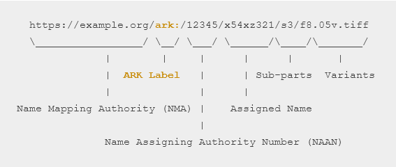
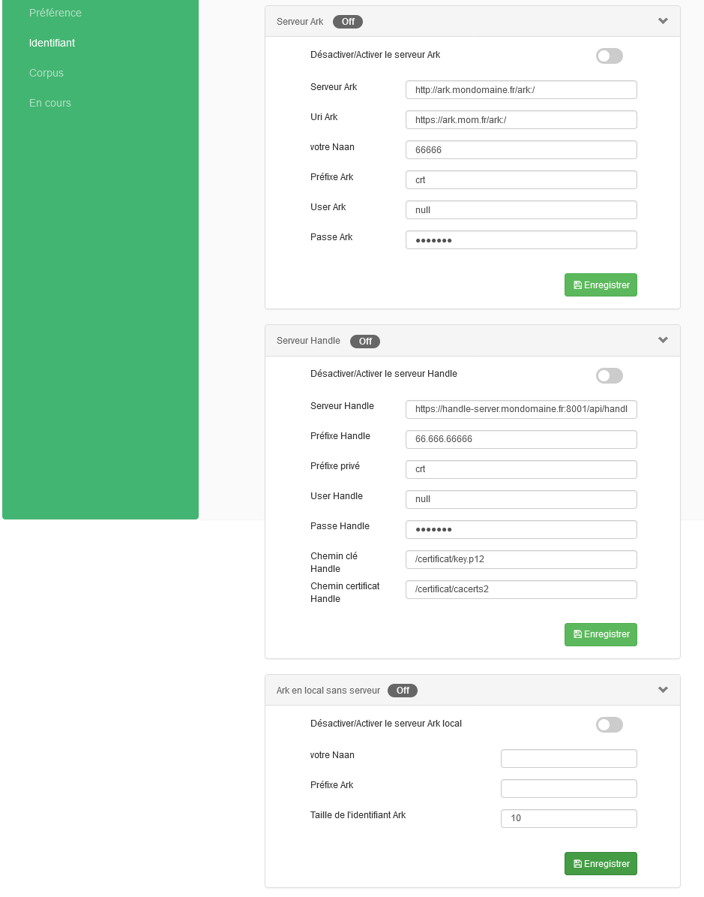

# Thesaurus aanbieden voor (her)gebruik

## gebruik van PIDs

### Archival Resource Keys (ark)

Archival Resource Key (ARK) identifiers are URLs that support long-term access to information. Learn below what you need to know about ARKs, whether you’re planning how your system or collection will use them, or you’re a developer building ARK tools. https://arks.org/about/

Voor het configureren van Arks zijn er verschillende opties:

De Server opties zijn vooral gericht op naar het (Franse) consortium dat achter Opentheso zit en vereisen een login bij een externe dienst die voor het resolven/activeren zorgt.

De onderste optie helpt je al wel om 'ark-achtige' identifiers aan te maken die eventueel later kunnen geactiveerd worden.

## koha koppeling

## omeka-s koppeling

Omeka-s is een open source content management systeem dat vooral bedoeld is voor het publiceren van erfgoedcollecties. https://omeka.org/s/

Binnen omeka-s kan je 'Resource templates' bouwen met verschillende metadatavelden. Mits enige configuratie (https://opentheso.hypotheses.org/3231) kan je voor een veld instellen dat er gebruik moet gemaakt worden van een thesaurus uit opentheso (ook andere thesauri zoals aat zijn beschikbaar).
https://github.com/omeka-s-modules/ValueSuggest

In dit demo voorbeeld is het veld Subject gelinkt aan de Pactols onderwerpen thesaurus:

Bij het invullen van het metadataveld krijg je dan een autocomplete functie te zien:

# playtime

## skosplay

## virtuoso

## openrefine(?)

...
