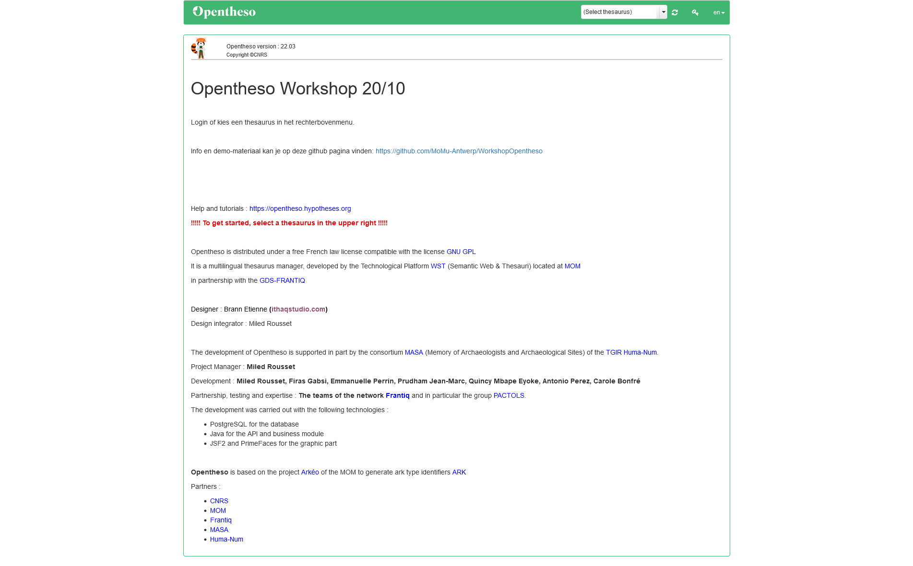
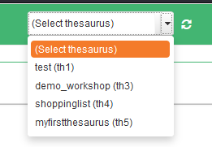

# Basis functionaliteiten

Het beginscherm van Opentheso ziet er zo uit:

> let op: we gebruiken voor deze workshop versie 22.03. Deze versie is niet de meest recente. Sindsdien is de interface en een aantal functionaliteiten grondig veranderd. Een publiek voorbeeld van een meer recente versie van opentheso staat hier: https://pactols.frantiq.fr/opentheso/

## (publieke) Thesaurus selecteren

Wanneer je nog niet ingelogd bent als gebruiker, kan je in het rechterbovenmenu enkel de gepubliceerde thesauri selecteren.

## Inloggen

Naast het thesaurus selectie vak, staat een login knop. Gebruik deze om in te loggen met de aan jou toegekende username/wachtwoord

## Taal selecteren

Naast de login knop kan je de taal van de interface selecteren.
> let op: de vertalingen zijn nog niet allemaal volledig. Enkel de Franstalige interface is compleet. In recentere versies zou de vertaling (vooral Engels) completer moeten zijn.  

## thesaurus bekijken

### overzicht/details

## zoeken

---
> volgende: [creëer een nieuwe thesaurus](https://github.com/MoMu-Antwerp/WorkshopOpentheso/blob/main/nieuwethesaurus.md)
