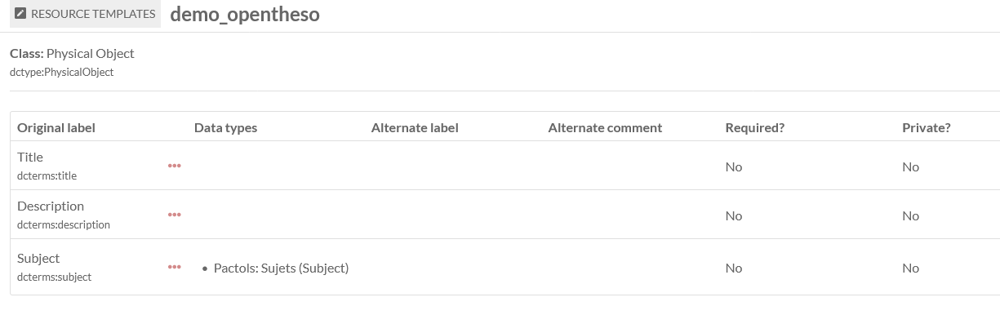
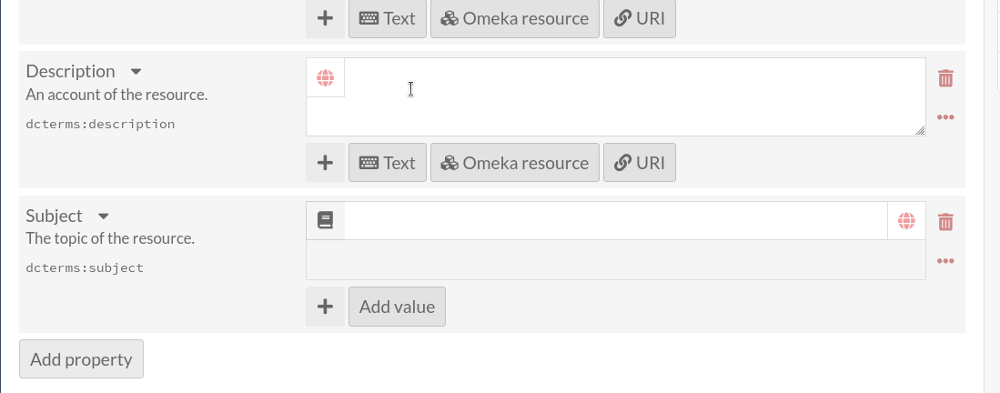

# Thesaurus aanbieden voor (her)gebruik

## gebruik van PIDs

### Archival Resource Keys (ark)

## koha koppeling

## omeka-s koppeling

Omeka-s is een open source content management systeem dat vooral bedoeld is voor het publiceren van erfgoedcollecties. https://omeka.org/s/

Binnen omeka-s kan je 'Resource templates' bouwen met verschillende metadatavelden. Mits enige configuratie (https://opentheso.hypotheses.org/3231) kan je voor een veld instellen dat er gebruik moet gemaakt worden van een thesaurus uit opentheso (ook andere thesauri zoals aat zijn beschikbaar).
https://github.com/omeka-s-modules/ValueSuggest

In dit demo voorbeeld is het veld Subject gelinkt aan de Pactols onderwerpen thesaurus:

Bij het invullen van het metadataveld krijg je dan een autocomplete functie te zien:

# playtime
- skosplay
- virtuoso
- openrefine(?)
...
