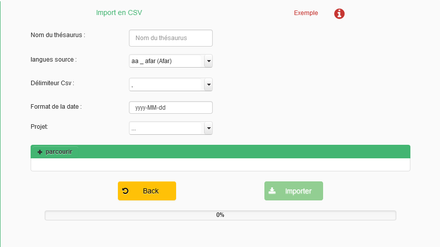

# Excel naar opentheso

## bestand voorbereiden

Voor het importeren van een excel-bestand, verwacht opentheso dat deze aan aantal eisen voldoet:
- csv formaat: Comma separated value (csv) is een bestandsformaat voor tabelgegevens dat door meerdere applicaties kan geopend en bewerkt worden, bijvoorbeeld met de meest basic tekst editor.
- skos-hoofdingen: de hoofdingen van de kolommen moeten overenkomen met het skos datamodel.
- ID's: de eerste kolom moet een unieke identifier hebben. Deze kan gebruikt worden om de hiërarchie te bepalen.

1. download de sample csv

[sample.csv](sample.csv)

## thesaurus importeren
via Toolbox --> Importer

![[Pasted image 20220809155937.png]]

- kies "csv" als gewenst formaat.
- via "Parcourir" selecteer het importbestand (in dit geval sample.csv)
- vul de naam van de thesaurus in
- selecteer de hoofdtaal van de thesaurus (in dit geval nl)
- selecteer het juiste project (in dit geval workshop)
- kijk de rest van de settings na
- klik op Importer

![[Pasted image 20220809160739.png]]

- refresh de thesauruslijst rechts bovenaan door op de refreshknop te klikken
  ![[Pasted image 20220809160919.png]]
- selecteer de nieuwe thesaurus
  ![[Pasted image 20220809161011.png]]
---

> volgende: [thesaurus (her)bruikbaar maken](https://github.com/MoMu-Antwerp/WorkshopOpentheso/blob/main/hergebruik.md)
