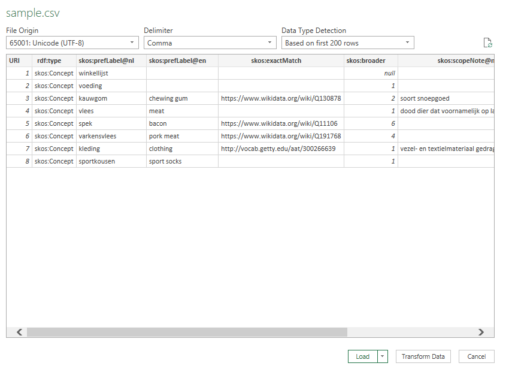

# Excel naar opentheso

## bestand voorbereiden

Voor het importeren van een excel-bestand, verwacht opentheso dat deze aan aantal eisen voldoet:
- csv formaat: Comma separated value (csv) is een bestandsformaat voor tabelgegevens dat door meerdere applicaties kan geopend en bewerkt worden, bijvoorbeeld met de meest basic tekst editor.
- skos-hoofdingen: de hoofdingen van de kolommen moeten overenkomen met het skos datamodel.
- URI: de eerste kolom moet een unieke identifier (URI) hebben. Deze kan dan ondermeer gebruikt worden om de hiërarchie te bepalen.

1. download de sample csv door op deze link [sample.csv](https://github.com/MoMu-Antwerp/WorkshopOpentheso/raw/main/sample.csv)
 te klikken, daarna rechts klikken 'save page as'

2. open het bestand in een editor naar keuze (excel, libreoffice calc, ...)
> tip: om een csv te openen in excel kan je best een nieuw, leeg bestand openen; Nadien kan je de csv importeren via de Data tab, import From Text/CSV 
> Selecteer UTF-8 als File Origin en klik op Load

3. Voeg een aantal concepten en scopenotes toe, of maak enkele vrije aanpassingen

## thesaurus importeren
via Toolbox --> Importer

Let op volgende dingen:
- (voor de live workshop:) gebruik als naam een unieke naam (liefts met je username), kies de taal en voeg toe aan het juiste project
- excel gebruikt default een puntkomma als 'Délimiteur Csv'
- je krijgt indien het bestand succesvol is opgeladen een melding 'File correctly loaded' en

- klik op Importer

- refresh de thesauruslijst rechts bovenaan door op de refreshknop te klikken
- selecteer de nieuwe thesaurus

---

> volgende: [geavanceerde functionaliteiten](advanced.md)
