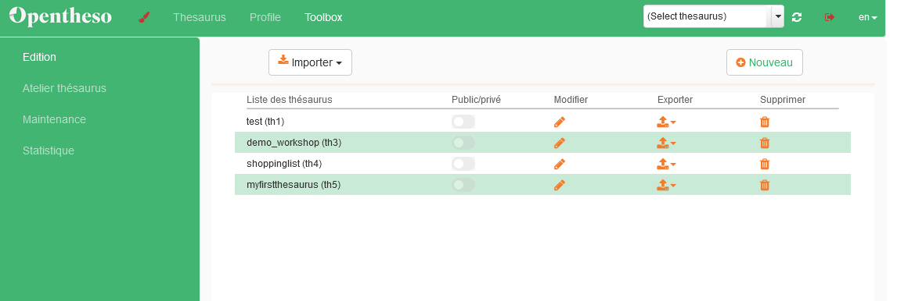

# Creëer een Thesaurus

## Als eerste oefening creëren we een thesaurus 'from scratch':


 - Klik op Toolbox:
 
 - Daarna op Nouveau: 
 - Geef een naam, selecteer een taal en druk vervolgens op "Créer": 
 - De thesaurus verschijnt nu in de lijst:


> <b>Note</b>: Standaard staat een nieuwe thesaurus op publiek beschikbaar

- Je thesaurus is nog niet meteen beschikbaar in het 'thesaurus-selectie-veld'. Klik op de refresh-knop ernaast om hem beschikbaar te maken: 

## Eerste concept

- Selecteer de nieuwe thesaurus in het selectieveld:

> Deze is nog volledig leeg


 - Klik op het plusteken in het overzichtvenster om een eerste, 'top concept' aan te maken: 

 - Vul de naam en eventueel de beschrijving (Notation) in en klik op <b>Validate</b>:

 
 > <i>Voor deze oefening is enkel de <b>naam</b> van het top concept belangrijk. De andere functies komen later aan bod.</i>


## Meer Concepten
- voeg een 10-tal Narrower terms toe door op het plusteken naast je top concept te klikken en 'Concept' te kiezen: 
    
    - je kan meerdere concepten na elkaar invoeren:
      - voeg minstens twee verschillende pasta soorten en kauwgom toe. Deze gaan we nodig hebben in een volgende stap.

    


## Hiërarchie aanbrengen

- breng nieuwe structuur aan (door bijvoorbeeld een nieuw concept 'pasta' aan te maken.
- klik en sleep de pastasoorten naar 'pasta'


- breng nog wat verder hiërarchie aan door verschillende tussenniveaus aan te brengen (vb 'voedsel' ; 'drank' ; 'conserven' ; ...)


- maak een vertaling voor een Concept
- aligneer een concept met wikidata


- maak een tweede top concept 'To do lijst'

## Facetten

Het is mogelijk om in plaats van een concept aan te maken, te kiezen voor 'new Facet'.
Je mag er gerust mee experimenteren maar hier hebben we zelf in onze usecases nog geen gebruik van gemaakt.
Wanneer je een Facet aanmaakt, krijgt het in de skos export het volgende label:

``` xml
    <!-- http://purl.org/iso25964/skos-thes#ThesaurusArray -->

    <owl:Class rdf:about="http://purl.org/iso25964/skos-thes#ThesaurusArray">
        <rdfs:subClassOf rdf:resource="http://www.w3.org/2004/02/skos/core#Collection"/>
        <dcterms:modified rdf:datatype="http://www.w3.org/2001/XMLSchema#date">2013-12-09</dcterms:modified>
        <rdfs:isDefinedBy rdf:resource="http://purl.org/iso25964/skos-thes"/>
        <rdfs:label xml:lang="en">Thesaurus Array</rdfs:label>
        <vs:term_status rdf:datatype="http://www.w3.org/2001/XMLSchema#string">released</vs:term_status>
        <skos:definition xml:lang="en">Definition: ISO ThesaurusArray
An array is a group of sibling concepts

Instances of ThesaurusArray can be mapped to instances of skos:OrderedCollection (a subclass of skos:Collection) if and only if the array needs to be an ordered array (in the ISO-25964 model the value of its Boolean attribute "ordered" is true).
It is advised to use the skos:inScheme (http://www.w3.org/2004/02/skos/core#inScheme) property on such a skos:Collection to relate it to its Thesaurus (see ISO 25964: isPartOf).

Concepts in a thesaurus array are sibling concepts in the thesaurus.

If present, the node label of a thesaurus array is mapped to rdfs:label or xl:prefLabel.
Optional node label attributes typically are mapped to dc: (or dct:) properties:
- dct:created
- dct:modified
These can be attached (if needed) to the xl:Label instance that is the value of xl:prefLabel.</skos:definition>
    </owl:Class>
```

## Collecties

Een andere manier om je concepten te structureren is aan de hand van 'Collecties'.

Voor deze workshop maken we collecties aan voor de winkels waar we de items uit onze shoppinglijst kunnen kunnen terugvinden.
Navigeer naar 'Collection' in het overzichtsvenster


- klik op het plusteken en maak enkele 'collections' aan


- Om concepten toe te voegen aan een collectie, ga terug naar de Concept-tab en selecteer een concept.

- Klik op het tandwieltje bij 'Collection' en kies of je het enkel het conept of het concept en onderliggende concepten (narrower terms) wil toevoegen aan een collectie.


> volgende: [thesaurus op basis van een excel-bestand](https://github.com/MoMu-Antwerp/WorkshopOpentheso/blob/main/import_csv.md)
